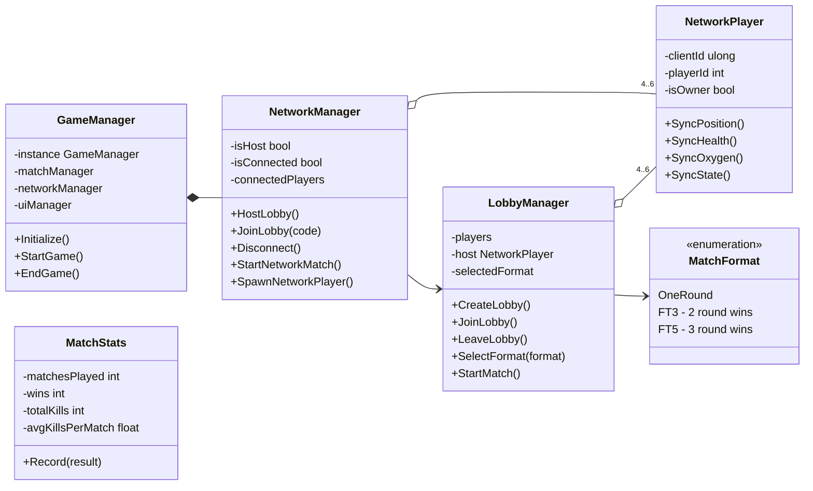
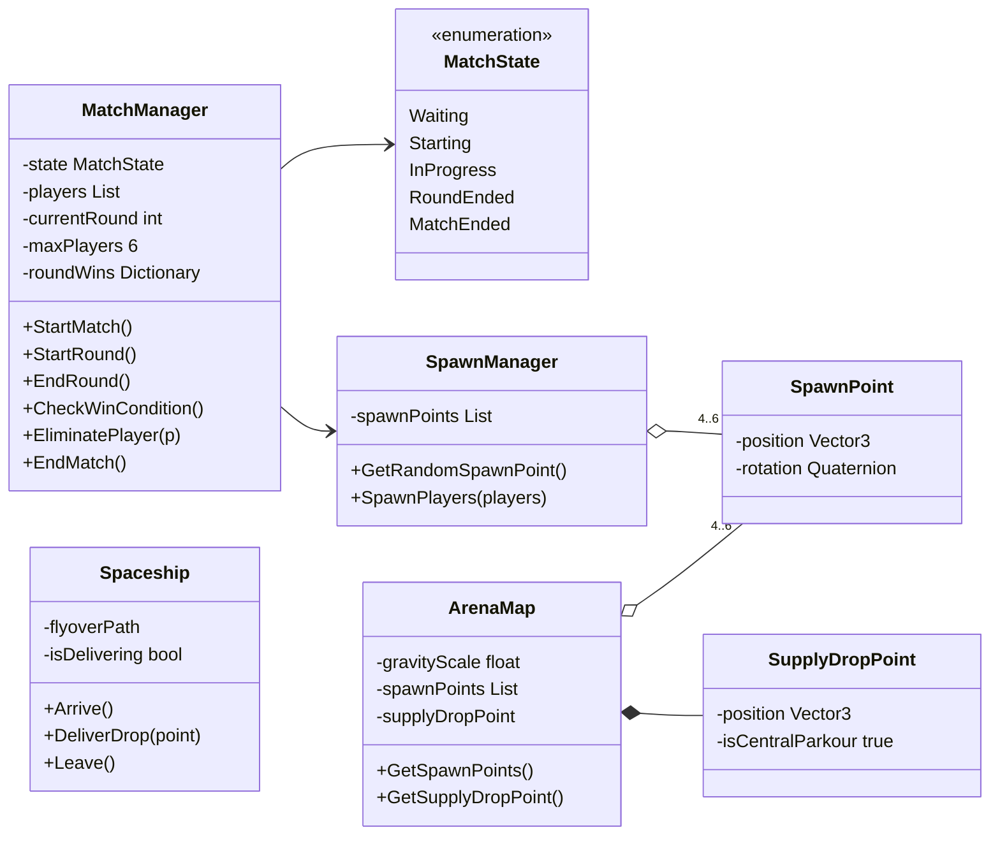
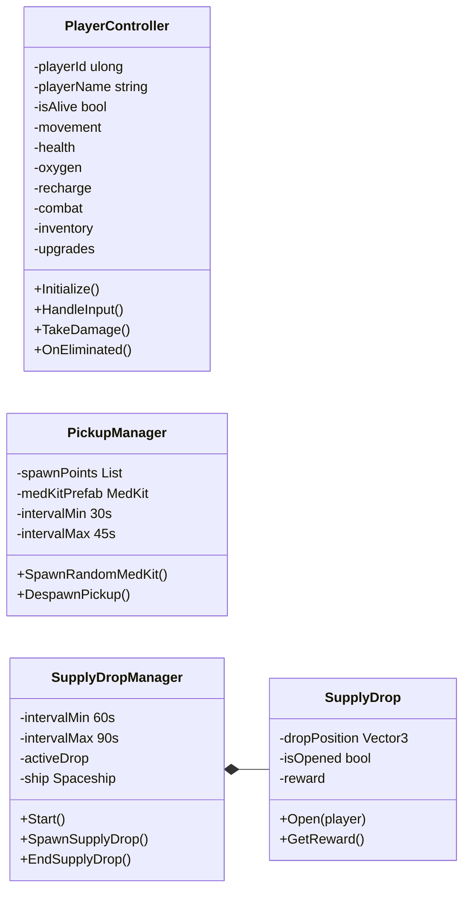
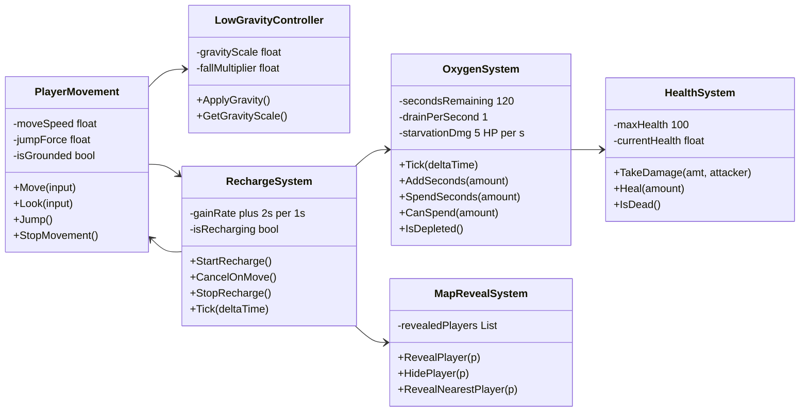
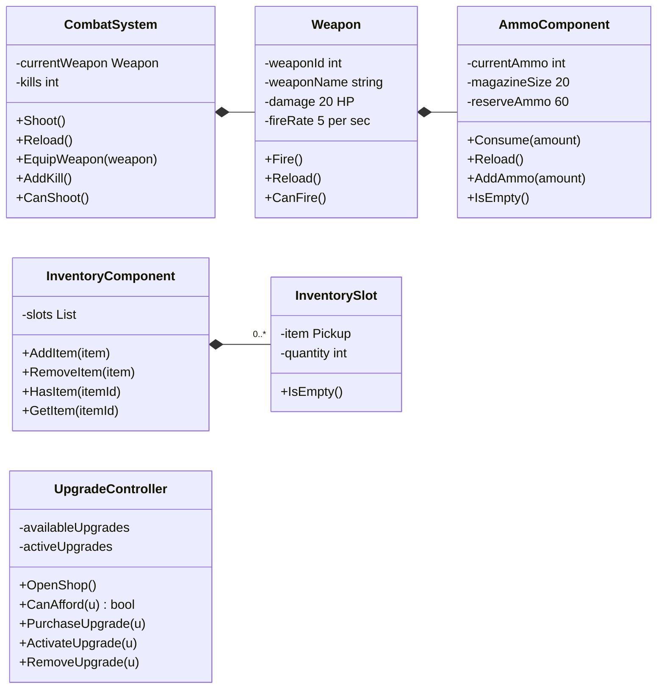
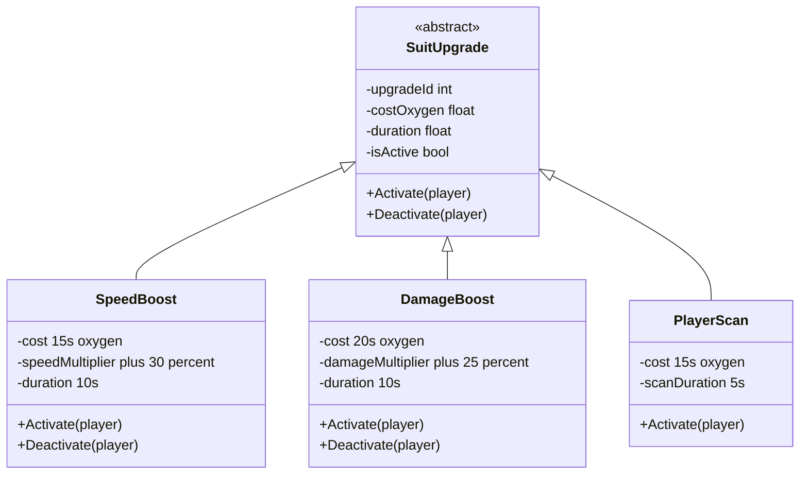
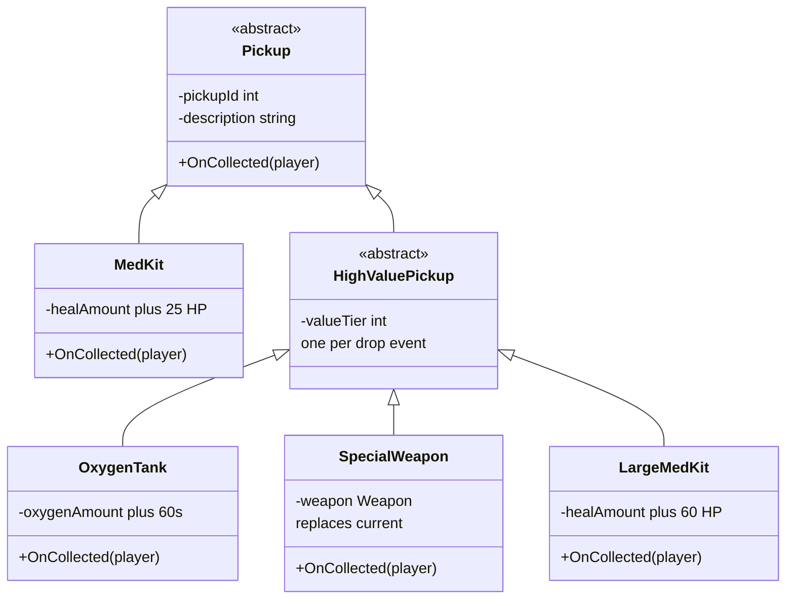
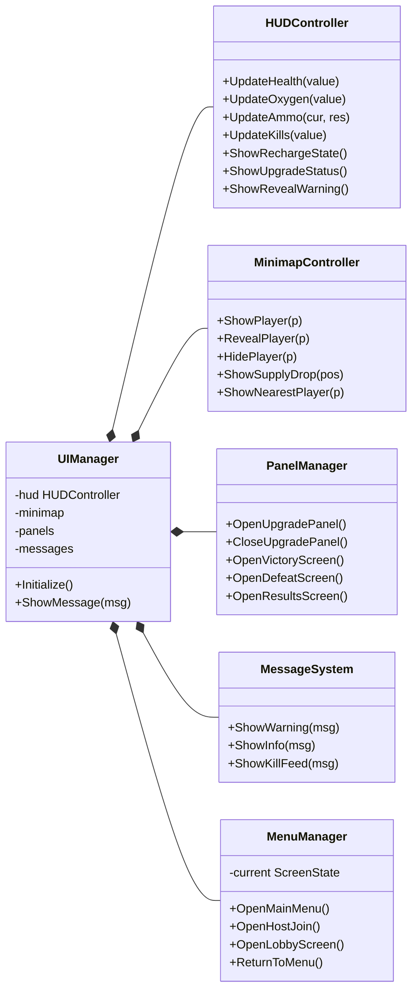

# One More Sec — Master Class Diagram

All 45 classes and every relation, written out from the team's master diagram
(`No Bugs Inshallah · Master Class Diagram · v1.0`).

3D first-person multiplayer survival shooter, 4–6 players, Mars colony construction site.
The diagram reads left to right, from the session root out to the interface.

| # | Column | Classes |
| --- | --- | --- |
| 0 | ROOT · SESSION + NETCODE | 6 |
| 1 | MATCH & WORLD | 7 |
| 2 | PLAYER HUB · SPAWNERS | 4 |
| 3 | SUIT SYSTEMS | 6 |
| 4 | COMBAT · INVENTORY · ECONOMY | 6 |
| 5 | UPGRADE HIERARCHY | 4 |
| 6 | PICKUP HIERARCHY | 6 |
| 7 | INTERFACE | 6 |

---

## The four rules the design hangs on

**Oxygen is a timer, not a bar.** It starts at 120s, drains 1 per second, has **no maximum
cap**, costs 5 HP/sec once it hits zero, and pays for every upgrade.

**One way out of a round.** Weapons, suffocation and med kits all write to `HealthSystem`.
Only `HealthSystem` calls `MatchManager.EliminatePlayer()`.

**Recharge is cancelled by movement.** `RechargeSystem` locks movement, and any movement
input cancels the recharge — which also clears the reveal on every opponent's map.

**Two loot paths, one hierarchy.** `PickupManager` only spawns standard med kits, every
30–45s. Everything under `HighValuePickup` reaches players through the spaceship drop
instead, every 60–90s, one item per event.

---

## 0 · ROOT · SESSION + NETCODE

`GameManager` is the singleton root: it owns `MatchManager`, `NetworkManager` and
`UIManager`. `MatchStats` is marked *full version* — it is the persistent career record,
not part of a single match.

---

## 1 · MATCH & WORLD

`MatchManager` is the round authority. `EliminatePlayer()` has exactly one caller in the
whole system: `HealthSystem`.

---

## 2 · PLAYER HUB · SPAWNERS

`PlayerController` is the hub: it owns seven sub-systems by composition, so they are
created with it and die with it.

---

## 3 · SUIT SYSTEMS

`OxygenSystem` has **no maximum cap** — that is what makes an oxygen tank worth taking even
at full health. The two arrows between `RechargeSystem` and `PlayerMovement` are the
cancel-on-move rule, one in each direction.

---

## 4 · COMBAT · INVENTORY · ECONOMY

---

## 5 · UPGRADE HIERARCHY

Every upgrade is bought with oxygen seconds, which is why `UpgradeController` talks to
`OxygenSystem`. Each subclass reaches a different sub-system: speed, damage, or the map.

---

## 6 · PICKUP HIERARCHY

Two loot paths, one hierarchy: `MedKit` comes from `PickupManager` every 30–45s, while
everything under `HighValuePickup` only arrives inside a `SupplyDrop`, one item per event.

---

## 7 · INTERFACE

---

## Every relation

**Composition ◆** — the owner creates the part and the part dies with it.

| Owner | Part | Multiplicity |
| --- | --- | --- |
| `GameManager` | `MatchManager` | 1 |
| `GameManager` | `NetworkManager` | 1 |
| `GameManager` | `UIManager` | 1 |
| `ArenaMap` | `SupplyDropPoint` | 1 |
| `PlayerController` | `PlayerMovement` | 1 |
| `PlayerController` | `HealthSystem` | 1 |
| `PlayerController` | `OxygenSystem` | 1 |
| `PlayerController` | `RechargeSystem` | 1 |
| `PlayerController` | `CombatSystem` | 1 |
| `PlayerController` | `InventoryComponent` | 1 |
| `PlayerController` | `UpgradeController` | 1 |
| `CombatSystem` | `Weapon` | 1 |
| `Weapon` | `AmmoComponent` | 1 |
| `InventoryComponent` | `InventorySlot` | 0..* |
| `SupplyDropManager` | `SupplyDrop` | 1 |
| `SupplyDropManager` | `Spaceship` | 1 |
| `SupplyDrop` | `HighValuePickup` | 1 |
| `UIManager` | `HUDController` | 1 |
| `UIManager` | `MinimapController` | 1 |
| `UIManager` | `PanelManager` | 1 |
| `UIManager` | `MessageSystem` | 1 |
| `UIManager` | `MenuManager` | 1 |

**Aggregation ◇** — the holder keeps a reference but does not own the lifetime.

| Holder | Item | Multiplicity |
| --- | --- | --- |
| `NetworkManager` | `NetworkPlayer` | 4..6 |
| `LobbyManager` | `NetworkPlayer` | 4..6 |
| `MatchManager` | `PlayerController` | 4..6 |
| `SpawnManager` | `SpawnPoint` | 4..6 |
| `ArenaMap` | `SpawnPoint` | 4..6 |
| `UpgradeController` | `SuitUpgrade` | 0..* |
| `PickupManager` | `MedKit` | 0..* |

**Inheritance ▷** — "is a".

| Child | Parent |
| --- | --- |
| `SpeedBoost` | `SuitUpgrade` |
| `DamageBoost` | `SuitUpgrade` |
| `PlayerScan` | `SuitUpgrade` |
| `MedKit` | `Pickup` |
| `HighValuePickup` | `Pickup` |
| `OxygenTank` | `HighValuePickup` |
| `SpecialWeapon` | `HighValuePickup` |
| `LargeMedKit` | `HighValuePickup` |

**Association →** — uses, but does not hold.

| From | To | What it is |
| --- | --- | --- |
| `NetworkManager` | `LobbyManager` | lobby lifecycle |
| `NetworkManager` | `MatchManager` | starts the match |
| `LobbyManager` | `MatchFormat` | one round / FT3 / FT5 |
| `LobbyManager` | `MatchManager` | hands the lobby over |
| `NetworkPlayer` | `PlayerController` | 1, the local avatar |
| `MatchManager` | `MatchState` | current phase |
| `MatchManager` | `SpawnManager` | spawns the round |
| `MatchManager` | `SupplyDropManager` | starts the drop cycle |
| `MatchManager` | `PanelManager` | victory / defeat / results |
| `MatchManager` | `MatchStats` | records the result |
| `ArenaMap` | `LowGravityController` | map gravity scale |
| `PlayerMovement` | `LowGravityController` | applies gravity |
| `PlayerMovement` | `RechargeSystem` | movement cancels recharge |
| `RechargeSystem` | `PlayerMovement` | recharge locks movement |
| `RechargeSystem` | `OxygenSystem` | +2s per 1s |
| `RechargeSystem` | `CombatSystem` | cannot shoot while recharging |
| `RechargeSystem` | `MapRevealSystem` | recharging reveals you |
| `OxygenSystem` | `HealthSystem` | 5 HP/s once empty |
| `HealthSystem` | `MatchManager` | **the only call to EliminatePlayer** |
| `CombatSystem` | `HealthSystem` | applies damage |
| `Weapon` | `HealthSystem` | 20 HP per shot |
| `InventorySlot` | `Pickup` | 1, the item held |
| `UpgradeController` | `OxygenSystem` | pays for upgrades |
| `UpgradeController` | `PanelManager` | opens the shop |
| `SpeedBoost` | `PlayerMovement` | +30% speed |
| `DamageBoost` | `CombatSystem` | +25% damage |
| `PlayerScan` | `MapRevealSystem` | reveals nearest |
| `PlayerScan` | `MinimapController` | draws the marker |
| `MedKit` | `HealthSystem` | +25 HP |
| `LargeMedKit` | `HealthSystem` | +60 HP |
| `OxygenTank` | `OxygenSystem` | +60s |
| `SpecialWeapon` | `CombatSystem` | replaces the weapon |
| `SupplyDropManager` | `SupplyDropPoint` | where it lands |
| `SupplyDropManager` | `MinimapController` | marks the drop |
| `SupplyDropManager` | `UIManager` | announces the drop |
| `Spaceship` | `SupplyDrop` | delivers it |
| `MapRevealSystem` | `MinimapController` | draws reveals |
| `MenuManager` | `LobbyManager` | host / join screens |
| `HealthSystem` | `HUDController` | health readout |
| `OxygenSystem` | `HUDController` | oxygen timer |
| `AmmoComponent` | `HUDController` | ammo counter |
| `RechargeSystem` | `HUDController` | recharge state |
| `UpgradeController` | `HUDController` | active upgrade status |
| `CombatSystem` | `HUDController` | kill counter |

---

## Reading the notation

| Symbol | Name | Means | In C# |
| --- | --- | --- | --- |
| ◆ filled diamond | Composition | owns it, dies with it | field created with `new` |
| ◇ hollow diamond | Aggregation | holds it, does not own it | a list passed in from outside |
| ▷ hollow triangle | Inheritance | "is a" | `class Child : Parent` |
| → open arrow | Association | uses it | a method call on a reference |

The interactive version of this diagram, where clicking a class isolates everything it
touches, lives at
<https://claude.ai/code/artifact/c2c7d8f3-ce3a-41e0-a6a0-46082d1bb0af>.
