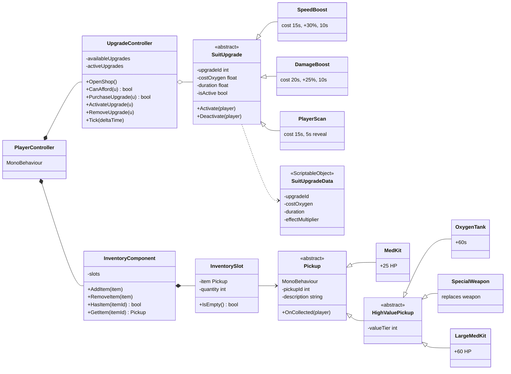

# Upgrades · Pickups · Inventory

Design notes for three systems of **One More Sec**, taken from the master class diagram.

| System | Diagram column | Folder |
| --- | --- | --- |
| Suit upgrades | UPGRADE HIERARCHY | `Assets/Scripts/UpgradeSystem` |
| Upgrade economy | COMBAT · INVENTORY · ECONOMY | `Assets/Scripts/UpgradeSystem` |
| Pickups | PICKUP HIERARCHY | `Assets/Scripts/PickupSystem` |
| Inventory | COMBAT · INVENTORY · ECONOMY | `Assets/Scripts/InventorySystem` |

`Assets/Scripts/Sandbox` is throwaway test code and is not part of the design.

---

## 1. The picture

---

## 2. Relations

| From | To | Relation | Meaning | In code |
| --- | --- | --- | --- | --- |
| `SpeedBoost` `DamageBoost` `PlayerScan` | `SuitUpgrade` | Inheritance ▷ | "is a" | `: SuitUpgrade` |
| `MedKit` `HighValuePickup` | `Pickup` | Inheritance ▷ | "is a" | `: Pickup` |
| `OxygenTank` `SpecialWeapon` `LargeMedKit` | `HighValuePickup` | Inheritance ▷ | "is a" | `: HighValuePickup` |
| `PlayerController` | `UpgradeController` | Composition ◆ | owns it, dies with it | field created with `new` |
| `PlayerController` | `InventoryComponent` | Composition ◆ | owns it | field created with `new` |
| `InventoryComponent` | `InventorySlot` | Composition ◆ 0..* | owns the rows | `List<InventorySlot>` |
| `UpgradeController` | `SuitUpgrade` | Aggregation ◇ 0..* | holds, does not own | `List<SuitUpgrade>` passed in |
| `InventorySlot` | `Pickup` | Association → 1 | refers to it | `Pickup m_Item` |
| `UpgradeController` | `OxygenSystem` | Association → | spends oxygen | via `IOxygenBank` |
| `UpgradeController` | `PanelManager` | Association → | opens the shop | via `IUpgradeShopView` |
| `SpeedBoost` | `PlayerMovement` | Association → | changes speed | via `IMovementModifier` |
| `DamageBoost` | `CombatSystem` | Association → | changes damage | via `IDamageModifier` |
| `PlayerScan` | `MapRevealSystem` | Association → | reveals a player | via `IRevealService` |
| `MedKit` `LargeMedKit` | `HealthSystem` | Association → | heals | via `IHealthPool` |
| `OxygenTank` | `OxygenSystem` | Association → | refills | via `IOxygenRefill` |
| `SpecialWeapon` | `CombatSystem` | Association → | swaps weapon | via `IWeaponHolder` |

**Inheritance vs composition** — the two are easy to mix up. Inheritance is *"is a"*: a `SpeedBoost` **is a** `SuitUpgrade`, so it can be used anywhere a `SuitUpgrade` is expected. Composition is *"has a"*: a `PlayerController` **has an** `UpgradeController` living inside it. Nothing in these three systems inherits from `PlayerController`.

---

## 3. The classes

### Upgrades

| Class | Kind | Notes |
| --- | --- | --- |
| `SuitUpgrade` | abstract, plain C# | Holds id, cost, duration, isActive. `Activate`/`Deactivate` are `virtual`; subclasses override and call `base` |
| `SpeedBoost` | plain C# | Registers a speed multiplier on `PlayerMovement`, removes it on expiry |
| `DamageBoost` | plain C# | Registers a damage multiplier on `CombatSystem` |
| `PlayerScan` | plain C# | Reveals the nearest opponent, remembers who, hides only that one |
| `UpgradeController` | plain C# | Catalogue, purchase rules, countdown |
| `SuitUpgradeData` | ScriptableObject | The numbers, as an asset |

### Pickups

| Class | Kind | Notes |
| --- | --- | --- |
| `Pickup` | abstract, MonoBehaviour | Trigger detection and despawn, written once for the whole tree |
| `MedKit` | MonoBehaviour | Spawned around the map by `PickupManager` every 30–45s |
| `HighValuePickup` | abstract, MonoBehaviour | Rare items; only reach players through the spaceship drop |
| `OxygenTank` | MonoBehaviour | Adds seconds; the player chooses to spend them on life or on upgrades |
| `SpecialWeapon` | MonoBehaviour | Replaces the current weapon — the one pickup a player can regret |
| `LargeMedKit` | MonoBehaviour | Separate class from `MedKit` because it arrives by a different path |

### Inventory

| Class | Kind | Notes |
| --- | --- | --- |
| `InventoryComponent` | plain C# | Groups items by `pickupId`, so two med kits share one slot |
| `InventorySlot` | plain C# | One stack: an item and a quantity |

### Why some are MonoBehaviour and some are not

A `Pickup` is a real object in the arena — mesh, position, trigger collider — so it belongs on a GameObject. A `SuitUpgrade` is pure logic living inside the player; it has nothing to draw and nothing to collide with, so making it a MonoBehaviour would mean three unused components on every player and no constructor to hand it its settings asset.

`PlayerController` is the only MonoBehaviour in the upgrade chain. It calls `UpgradeController.Tick(Time.deltaTime)` from its own `Update`.

---

## 4. What the systems need from the rest of the team

None of these classes reference `OxygenSystem`, `PlayerMovement`, `CombatSystem`, `MapRevealSystem`, `HealthSystem` or `PanelManager` directly, so all three folders compile before those classes exist. To connect them, implement the matching interface — nothing changes on this side.

| Your class | Interface | Methods |
| --- | --- | --- |
| `OxygenSystem` | `IOxygenBank` | `CanSpend`, `SpendSeconds` |
| `OxygenSystem` | `IOxygenRefill` | `AddSeconds` |
| `PlayerMovement` | `IMovementModifier` | `AddSpeedMultiplier`, `RemoveSpeedMultiplier` |
| `CombatSystem` | `IDamageModifier` | `AddDamageMultiplier`, `RemoveDamageMultiplier` |
| `CombatSystem` | `IWeaponHolder` | `EquipWeapon` |
| `HealthSystem` | `IHealthPool` | `Heal` |
| `MapRevealSystem` | `IRevealService` | `TryRevealNearestOpponent`, `HidePlayer` |
| `PanelManager` | `IUpgradeShopView` | `OpenUpgradePanel` |
| `PlayerController` | `IUpgradeTarget` | `PlayerId`, `Oxygen`, `Movement`, `Combat`, `Reveal` |
| `PlayerController` | `IPickupTarget` | `Health`, `OxygenRefill`, `Weapons` |

`OxygenSystem` implements two interfaces on purpose: upgrades may only *spend* oxygen and pickups may only *add* it, so neither is handed the other's power.

The multipliers are **keyed by upgrade id** — `AddSpeedMultiplier(1, 1.3f)`. Please combine several sources by multiplying, and treat a repeated id as a replacement rather than a stack. A single `SetSpeedMultiplier(float)` would break as soon as two effects overlap.

---

## 5. Where this differs from the class diagram

| Addition | Why |
| --- | --- |
| `UpgradeController.Tick(deltaTime)` | The diagram gives every upgrade a `duration` but nothing that counts it down |
| `UpgradeController.RemoveAllUpgrades()` | On elimination or round end, a multiplier would otherwise outlive the player |
| `PurchaseUpgrade` returns `bool` | The shop button needs to know whether to play the "bought" or "denied" feedback |
| `PlayerScan.Deactivate()` | The diagram lists only `Activate()`, but the 5-second reveal has to end |
| `SuitUpgradeData` | Balancing values live in an asset so they can be retuned without a code change |
| `Pickup.OnTriggerEnter` + `Despawn()` | Nothing would ever call `OnCollected` otherwise. Written once in the base class |
| `InventorySlot.Add/Remove` | The diagram gives it only `IsEmpty()`, but the quantity has to change somehow |
| The ten interfaces | The classes they stand for belong to other team members and do not exist yet |

Every one of these is marked with a comment in the code saying it is not in the diagram and why it is there.

---

## 6. Still open

1. **Networking.** These are plain rules and are not replicated. In this project (Netcode for Entities + GhostBridge) a purchase must be server-authoritative, and `Pickup.Despawn()` must run on the server or two players can collect the same med kit. `Despawn()` is `virtual` for exactly that reason.
2. **`FirstPersonController.cs:737`** holds `float combinedMoveSpeedModifier = 1f;` — a hard-coded placeholder that is where `SpeedBoost` has to reach. Feeding it needs a field on `ControllerState`, which the file warns is netcode-serialised.
3. **`MapRevealSystem` and `MinimapController` do not exist** anywhere in the project, so `PlayerScan` has nothing to talk to yet.
4. **A scan that finds nobody still costs oxygen.** Deliberate — the player paid to look. Needs a team decision before balancing.
5. **`PickupManager`** (spawns med kits every 30–45s) is not written yet.
